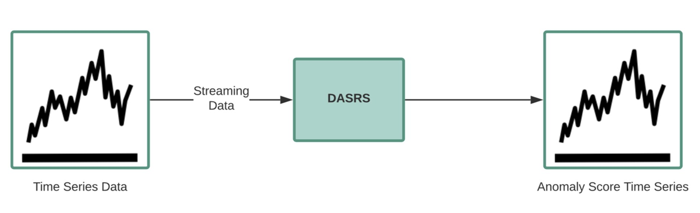

# Decreased Anomaly Score by Repeated Sequence (DASRS)
###### An Anomaly Detection Algorithm for Time Series

The DASRS algorithm identifies and counts the sequences of normalized values that appear in a time series and generates an anomaly score as a function of the number of times it identifies each sequence. We normalize observed values to limit the number of distinct sequences without changing the main characteristics of a time series. As the normalization reduces the number of distinct sequences, we can increase the performance of the anomaly detection algorithm. The first time DASRS identifies a given sequence, the returned score is as high as possible because the algorithm interprets it as a new behavior. Otherwise, the returned score decreases as the number of times a given sequence is found.

### Sequence

Let  be a time series with the observations . A sequence of  is a subset of  consisting of consecutive elements, for example, , with .

Let Xt be a time series with the observations x1, x2, ... . A sequence of Xt is a subset of Xt consisting of consecutive elements, for example, xi, ..., xj, with i < j.

### Normalization
The normalization applied by DASRS consists of transforming the observation value into an integer between  and a normalization factor that we call . The equation below represents the operations performed on  to get its normalized value ():

The normalization applied by DASRS consists of transforming the observation value into an integer between 0 and a normalization factor that we call θ. The equation below represents the operations performed on xi to get its normalized value (xi'):

Where  is the input observation (),  and  are respectively the smallest and highest possible observation values of .   represents the normalization factor,  is the normalized value of  observation,  and .

