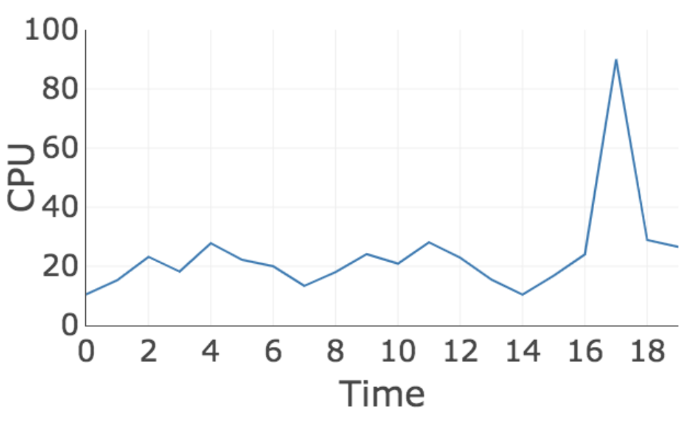

# Decreased Anomaly Score by Repeated Sequence (DASRS)
###### An Anomaly Detection Algorithm for Time Series

The DASRS algorithm identifies and counts the sequences of normalized values that appear in a time series and generates an anomaly score as a function of the number of times it identifies each sequence. We normalize observed values to limit the number of distinct sequences without changing the main characteristics of a time series. As the normalization reduces the number of distinct sequences, we can increase the performance of the anomaly detection algorithm. The first time DASRS identifies a given sequence, the returned score is as high as possible because the algorithm interprets it as a new behavior. Otherwise, the returned score decreases as the number of times a given sequence is found.

### Sequence

Let Xt be a time series with the observations x1, x2, ... . A sequence of Xt is a subset of Xt consisting of consecutive elements, for example, xi, ..., xj, with i < j.

### Normalization

The normalization applied by DASRS consists of transforming the observation value into an integer between 0 and a normalization factor that we call θ. The equation below represents the operations performed on xi to get its normalized value (xi'):

Where xi is the input observation (xi ∈ R, minX and maxX are respectively the smallest and highest possible observation values of Xt. θ  represents the normalization factor, xi' is the normalized value of xi observation, xi' ∈  N and 0 ≤ xi' ≤ θ.

The graphs below illustrate, respectively, a time series with observations of CPU usage and its equivalent normalized time series, with θ = 7.

| **Original Values**  | **Normalized Values** |
| ------------- | ------------- |
|   |   |

### Raw Score

We calculate the raw anomaly score, taking into account the current normalized sequence and the number of times that sequence appeared in the past. The raw anomaly score is given by the following equation:

Where occurrences represents the number of times the current sequence appears.

The graph below shows the raw anomaly scores calculated by DASRS.

###### Raw Anomaly Scores

The above equation does not generate the final anomaly score. As explained in [Real-Time Anomaly Detection for Streaming Analytics](https://arxiv.org/abs/1607.02480) and [Unsupervised real-time anomaly detection for streaming data](https://doi.org/10.1016/j.neucom.2017.04.070), many times, a dataset analyzed register unpredictable behaviors caused by noise or the random nature of some metrics, generating a large number of false positives.

To address this, we develope two versions of DASRS: **DASRS Rest** and **DASRS Likelihood**.

### DASRS Rest

DASRS Rest defines a period after identifying an anomaly, in which the final anomaly score should be smoothed. DASRS Rest understands that very close anomalies are part of the same phenomenon. Therefore, after identifying an anomaly, the following scores are decreased for a period defined by the **restPeriod** parameter.

The graph below shows the final anomaly scores calculated by DASRS Rest.

###### DASRS Rest Anomaly Scores

### DASRS Likelihood

We create DASRS Likelihood version from the [NuPIC library](http://nupic.docs.numenta.org/stable/index.html). DASRS Likelihood uses the anomaly likelihood metric, which is a measure of the probability of the current state being anomalous based on the history of the raw anomaly scores calculated by the algorithm. A detailed explanation of the Likelihood score calculation is in [Real-Time Anomaly Detection for Streaming Analytics](https://arxiv.org/abs/1607.02480) and [Unsupervised real-time anomaly detection for streaming data](https://doi.org/10.1016/j.neucom.2017.04.070).

The graph below shows the final anomaly scores calculated by DASRS Likelihood.

###### DASRS Likelihood Anomaly Scores

### Reference
For more details about DASRS, see the paper [Anomaly detection in data center machine monitoring metrics](https://www.maxwell.vrac.puc-rio.br/colecao.php?strSecao=resultado&nrSeq=46523@2)
